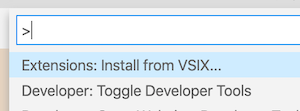

# Ember Related Files - Colocation Support

## Installation

1. Download the .vsix file in the release folder.
2. In VSCode <kbd>`shift`</kbd> + <kbd>`cmd`</kbd> + <kbd>`p`</kbd>, and begin typing 'Extensions: Install from VSIX...'
3. Select the .vsix file.

## Default keybinding

- **Mac**: <kbd>`alt`</kbd> + <kbd>`cmd`</kbd> + <kbd>`r`</kbd>
- **Win/Linux**: <kbd>`alt`</kbd> + <kbd>`ctrl`</kbd> + <kbd>`r`</kbd>

## Why?

This is [ember-related-files](https://github.com/josa42/vscode-ember-related-files) v1.4.0 + added support for: 
- indexed pod components (app/components/someComponent/index.js, index.css, index.hbs, etc.) as proposed by [component templates colocation](https://github.com/emberjs/rfcs/blob/master/text/0481-component-templates-co-location.md#detailed-design).

## Configuration

- `emberRelatedFiles.showQuickPickForSingleOption` (default: `false`)  
  Show pick quick list event if only one option is available.

- `emberRelatedFiles.enablePreview` (default: `true`)  
  Preview editors are reused until they are kept. If
  `workbench.editor.enablePreview` is set to `false` this setting has no effect.

## Contributing

1. `npm install` 
2. Update the [modified ember-related-files library](https://github.com/NoneOfMaster/ember-find-related-files) and tests.
3. Paste the updated library into the /src folder.
5. Debug
6. `vsce package` and move .vsix file to the release folder

## License

See: [LICENSE.md](https://github.com/josa42/vscode-markdown-table-formatter/blob/master/LICENSE.md)
